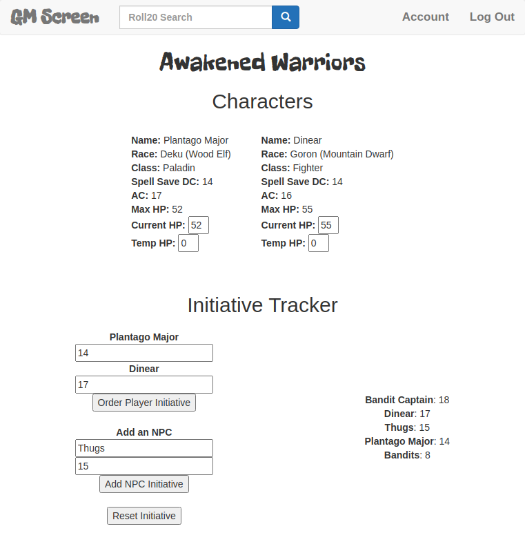

# GM Screen
GM Screen is a simple website, using the Flask framework, for a Game Master (GM) to keep track of Player Character (PC) stats in multiple Dungeons & Dragons 5e campaigns. Quickly add new PCs to a campaign or edit existing PCs as they level up. It features a dynamic initiative tracker to quickly order PCs and monsters in combat.

This tool was made as my final project for Harvard's free online computer science course, CS50. See the screen shot below of a campaign called "Awakened Warriors" that I am currently playing.

